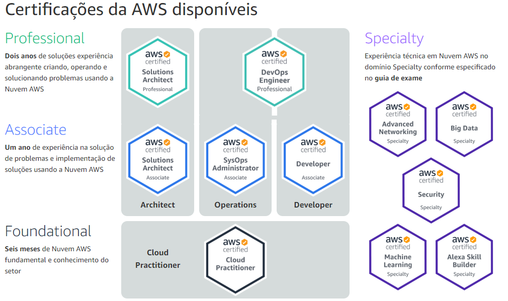

## aws-learning-data-engineering

## Esse repositório foi criado com o intuito de centralizar as informações necessárias para iniciar nas certificações de AWS. Desde estudos como laboratórios e etc.

## Todo o conteúdo vai ser dividido em pastas de acordo com a certificação específica e sempre atualizado conforme vou terminando os estudos.

AWS CLOUD PRACTIONER -> Pasta aws_cloud_practioner